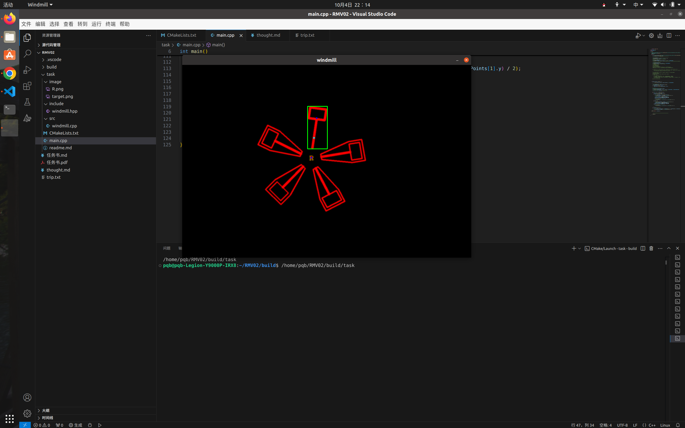

# 识别工作
   该图形轨迹为一条直线，中心R为圆心位置，故而仿真中，应该首先识别R的位置，进而根据R和目标矩形的相对位置来确定，周围有四个作为误导存在的扇页，初步想法是大抵确定这个围着R的圆，进行识别，无论障碍还是目标，而后进一步发现障碍与目标的不同之处  多重横线以及封闭面积存在不一样  还有轮廓面积
 ### 进行对字母R的识别
 具体的识别模型分为两种，首先是利用传统的视觉技术进行识别，优势在于面对例如本任务中较为简单的字母组合时，速度较快，
     另一种是采取机器学习，可以面对较为复杂的图形组合以及多变的字母字体
    先按照传统方法进行实现，利用给出的原图直接进行对比识别，设置一个近似识别率，在较低水准下，会在错误位置生成目标，提高阈值后，位置较为精准
### 进行对Hammer的识别
  观察到其他扇页和目标Hammer差距在面积较大，于是调用库函数计算各个部分的面积，其他扇叶的面积基本保持在10000以上，而目标Hammer的大小保持在4000以上 5000以下，生成想法按照面积进行筛选和标定，而后发现循环中也可以同时捕捉到R的轨迹，遂舍弃第一次利用的方法。而且位置极为精准  
  

  ### 反思：
  这种方法可能只适用于场景较为简单的环境，避免过多封闭线条所造成的运算量暴增，如果真的在现实场景进行应用的话，我觉得技术难点应该在于特征的提取和环境降噪，只有大量的除去环境杂质才能够发挥这个方法特有的优势，另外，目标数据的面积值应该存在明显差异，在计算面积的实践中，发现随着图形的旋转，他的面积会因为计算方法的缘故保持一个波动范围约为100的进行波动，所以以后此方法的改进之处可能在于优化面积的计算机制，引入更加优势的数学算法？（数学苯人不懂


#### 中心点
直接求出均值点，而后对剩下的中心点进一步求中值点即可
### CERES安装教程（ai友情赞助喵）
在 Ubuntu 中安装 Ceres 库，你可以按照以下步骤进行：

1. **安装依赖项**：
   首先，你需要安装 Ceres Solver 的一些依赖项。在终端中执行以下命令来安装这些依赖：
   ```bash
   sudo apt-get install liblapack-dev libsuitesparse-dev libcxsparse3 libgflags-dev libgoogle-glog-dev libgtest-dev
   ```
   如果遇到依赖性问题，可以尝试使用 `aptitude` 来解决：
   ```bash
   sudo apt-get update
   sudo apt-get install aptitude
   sudo aptitude install libsuitesparse-dev
   ```
   参考链接：

2. **下载源码**：
   接下来，从 Ceres Solver 的 GitHub 仓库克隆源代码到本地：
   ```bash
   cd ~/catkin_ws/src
   git clone https://github.com/ceres-solver/ceres-solver
   ```
   如果网络不佳，你也可以直接从官方网站下载源码包：http://ceres-solver.org/ceres-solver-2.0.0.tar.gz 
（很不幸，我在安装的时候进行git失败多次，最好通过官方网站直接安装，以下是按照官方网站安装的步骤）
要在 Ubuntu 中通过官方网站下载并编译安装 Ceres 库，请按照以下步骤操作：

1. **安装依赖项**：
   Ceres Solver 依赖于多个开源库。首先，你需要安装这些依赖项。在终端中执行以下命令来安装它们：
   ```bash
   sudo apt-get install cmake
   sudo apt-get install libgoogle-glog-dev libgflags-dev
   sudo apt-get install libatlas-base-dev
   sudo apt-get install libeigen3-dev
   sudo apt-get install libsuitesparse-dev
   ```

2. **下载 Ceres Solver 源码**：
   从 Ceres Solver 的官方网站下载源码。你可以下载最新的稳定版本或者克隆 git 仓库：
   ```bash
   wget http://ceres-solver.org/ceres-solver-2.2.0.tar.gz
   tar zxf ceres-solver-2.2.0.tar.gz
   ```
   或者通过 git 克隆：
   ```bash
   git clone https://ceres-solver.googlesource.com/ceres-solver
   ```

3. **编译安装 Ceres**：
   创建一个构建目录并编译 Ceres：
   ```bash
   mkdir ceres-bin
   cd ceres-bin
   cmake ../ceres-solver-1.4.0
   make -j3
   make test
   sudo make install
   ```
   这些命令将编译 Ceres，并运行测试。最后，`make install` 将 Ceres 安装到系统中。

4. **验证安装**：
   安装完成后，你可以通过检查 Ceres Solver 的版本来验证安装是否成功：
   ```bash
   cat /usr/local/include/ceres/version.h
   ```


好用喵

#### something addto envirnomment 
使用ctrl+shift+p 点击使用Cmake Quickstrat 选择对应CMakeLists文件，配置完成后，就会在左下角生成一个小三角可以方便编译了

#### debug
在CMakeLists配置中，为了方便起见，我将多部分识别函数打包成一个库，书写cmake文件中，错误的将add_libiries函数放置在了add_exctuable的后面，致使始终无法找到我的可执行库，调试两小时后，切换了位置终于解决（奇奇怪怪的bug）
### 拟合
原来直接根据中点，想象利用相对坐标系直接进行拟合，失败多次
后来重新构建模型，我想要通过这一帧和下一帧的对比，对这一帧secpoint进行平移操作到下一帧，记住同样的位移，对这一帧的fispoint同样处理，然后比对下一帧的fispoint计算出两帧之间变化的角度，进而算出速度，套用ceres模型进行拟合，规定50帧进行一次迭代，（第一次迭代的时候500帧一次，用时16秒），后面就成功了。


